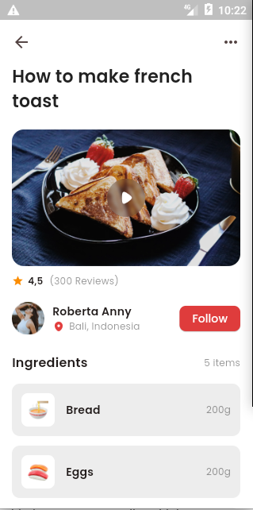

# Food Recipe

## Description

A simple flutter project with only the meal details screen aimed at understanding the basics of flutter and best practices involved in building flutter projects.

## Project Structure

The `libs` folder contains all flutter related codes. The project follows a component based approach breaking down reusable widgets as a standalone widget which can be found in the `widgets` folder. The `screens` folders contains the home screen and any other screen that will be added into the application.

Dummy data and models are stored inside the `data` and `models` folders respectively. The entry file for the application is the `main.dart` file.

## Screenshot



## Getting Started

### Prerequisites

- Flutter SDK
- Android Studio / XCode

### Setup

1. Clone the repository:

   ```bash
   git clone https://github.com/Chimise/foodrecipe.git
   cd foodrecipe
   ```

2. Install project dependencies:

   ```bash
    flutter pub get
   ```

3. Start your android or IOS emulator

4. Build and run the application:

   ```bash
   flutter run
   ```
